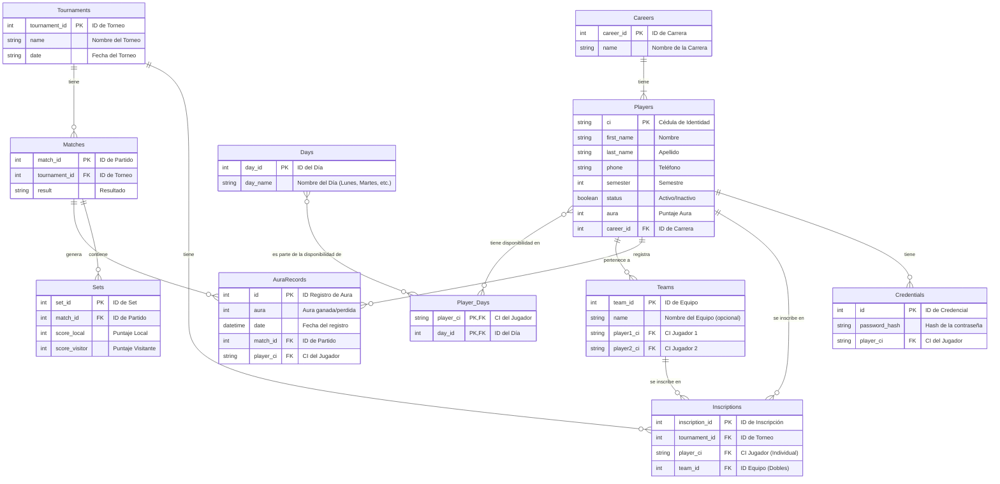

# Estructura de la Base de Datos - Liga de Ping Pong

Este documento detalla la arquitectura de la base de datos del sistema, incluyendo las tablas, sus campos y las relaciones entre ellas.

## Diagrama Entidad-Relación

El siguiente diagrama ofrece una visión general de cómo están conectadas las diferentes entidades del sistema.

## Descripción de Tablas

A continuación se detalla el propósito de cada tabla, sus columnas principales y sus relaciones.

### **Players**
Almacena la información de cada jugador. Es la tabla central del sistema.
- **`ci`** (PK, `string`): Cédula de identidad, usada como clave primaria única.
- **`first_name`**, **`last_name`** (`string`): Nombre y apellido del jugador.
- **`phone`** (`string`): Número de teléfono de contacto.
- **`semester`** (`int`): Semestre que cursa el estudiante.
- **`aura`** (`int`): El puntaje de habilidad o ranking del jugador.
- **`status`** (`boolean`): Estado del jugador (`true` para activo, `false` para inactivo/borrado lógico).
- **`career_id`** (FK, `int`): Clave foránea que referencia a la tabla `Careers`.

### **Careers**
Tabla catálogo para las carreras universitarias disponibles.
- **`career_id`** (PK, `int`): Identificador único autoincremental de la carrera.
- **`name`** (`string`): Nombre de la carrera (Ej: "Ingeniería de Software").

### **Credentials**
Guarda las credenciales para la autenticación de los jugadores.
- **`id`** (PK, `int`): Identificador único autoincremental.
- **`password_hash`** (`string`): La contraseña del usuario almacenada de forma segura (hasheada).
- **`player_ci`** (FK, `string`): Vincula la credencial a un jugador específico en la tabla `Players`. Es una relación **uno a uno**.

### **Teams**
Representa a los equipos para las modalidades de dobles.
- **`team_id`** (PK, `int`): Identificador único autoincremental del equipo.
- **`name`** (`string`, opcional): Nombre personalizado para el equipo.
- **`player1_ci`** (FK, `string`): CI del primer integrante, referencia a `Players`.
- **`player2_ci`** (FK, `string`): CI del segundo integrante, referencia a `Players`.

### **Tournaments**
Almacena la información general de los torneos.
- **`tournament_id`** (PK, `int`): Identificador único autoincremental del torneo.
- **`name`** (`string`): Nombre del torneo.
- **`date`** (`string` o `date`): Fecha de realización del torneo.

### **Inscriptions**
Tabla que registra qué jugadores o equipos participan en qué torneos.
- **`inscription_id`** (PK, `int`): Identificador único de la inscripción.
- **`tournament_id`** (FK, `int`): Referencia al torneo (`Tournaments`).
- **`player_ci`** (FK, `string`, opcional): Referencia al jugador (`Players`) para torneos individuales.
- **`team_id`** (FK, `int`, opcional): Referencia al equipo (`Teams`) para torneos de dobles.

### **Matches**
Contiene la información de cada partido dentro de un torneo.
- **`match_id`** (PK, `int`): Identificador único del partido.
- **`tournament_id`** (FK, `int`): Referencia al torneo al que pertenece el partido.
- **`result`** (`string`): Campo para almacenar el resultado final (ej. "2-1").

### **Sets**
Detalla los resultados de cada set dentro de un partido.
- **`set_id`** (PK, `int`): Identificador único del set.
- **`match_id`** (FK, `int`): Referencia al partido (`Matches`) al que pertenece el set.
- **`score_local`**, **`score_visitor`** (`int`): Puntuaciones de cada lado en el set.

### **AuraRecords**
Un historial de los cambios de "aura" (puntuación) de un jugador, vinculado a un partido específico.
- **`id`** (PK, `int`): Identificador único del registro.
- **`aura`** (`int`): El cambio en la puntuación (positivo o negativo).
- **`date`** (`datetime`): Fecha y hora en que ocurrió el cambio.
- **`match_id`** (FK, `int`): Referencia al partido (`Matches`) que originó el cambio.
- **`player_ci`** (FK, `string`): Referencia al jugador (`Players`) afectado.

### **Days** y **Player_Days**
Estas tablas manejan la disponibilidad de los jugadores.

#### **Days**
Tabla catálogo con los días de la semana.
- **`day_id`** (PK, `int`): Identificador único del día (ej: 1 para Lunes).
- **`day_name`** (`string`): Nombre del día ("Lunes", "Martes", etc.).

#### **Player_Days**
Tabla intermedia (o de unión) que crea una relación **Muchos a Muchos** entre `Players` y `Days`.
- **`player_ci`** (PK, FK, `string`): Referencia a la tabla `Players`.
- **`day_id`** (PK, FK, `int`): Referencia a la tabla `Days`.
